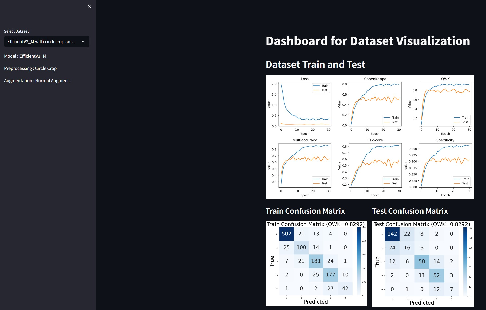

# Final Year Project with Diabetic Retinopathy Fine Grained Classification using Machine Learning

This is the final year project for the final year of my studies in Multimedia University (MMU)



## **Features**

- Interactive streamlit application to visualize result of the final year projects using streamlit
- Contains sample jupyter notebooks which shows the process of image preprocessing, model testing and result
  The TensorFlow version used is 2.10.1 requires 8.1 cuDNN and 11.2 CUDA to run properly
  The PyTorch version used is 2.0.1 requires CUDA 11.7

## **Getting Started**

```
HTTPS - git clone https://github.com/ChaoticHG/DRImageClassification.git

SSH - git clone git@github.com:ChaoticHG/DRImageClassification.git

cd .\DRImageClassification\

create python environment with python -m venv myenv

activate the environment with .\myenv\Scripts\activate

pip install -r requirements.txt

streamlit run app.py
```

## **Build with **

- streamlit
- openCV
- Pytorch
- TensorFLow
